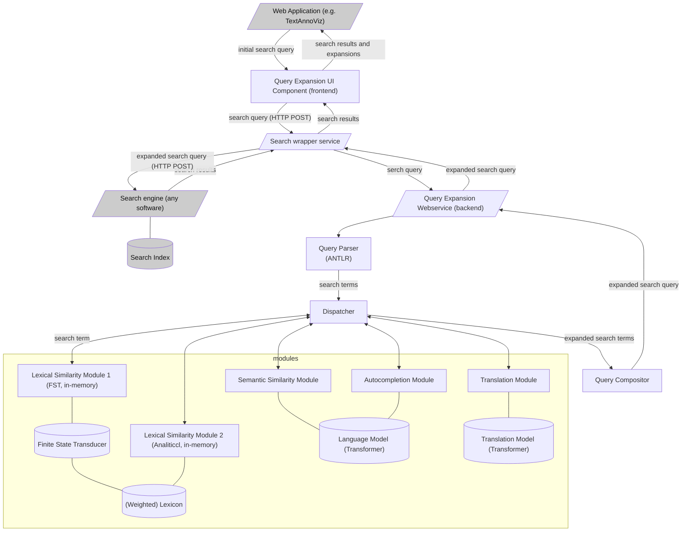

# Interactive Query Expansion Service

## Introduction

The Globalise project requests an interactive query expansion webservice which
expands terms in search queries with available synonyms and other suggestions.
These expansions are returned to the caller, for display in a user interface,
and the caller has control over which suggestions to accept or discard,
offering a high degree of control over the final query.

The system should be set up in such a way that we can can experiment with different
query expansion mechanisms.

Note that the service proposed here concerns only the backend system in this stage.

## Architecture

I see two architectural options:

1. The expansion service may takes the form of a query rewrite service and sits as a mediator between the 
   frontend and the actual search index:
	* It receives a query (e.g. using Lucene query syntax), 
    * The query is parsed (e.g. using ANTLR) and terms identifies
    * Expansions for terms are computed
    * A new query is formulated with disjunctions of terms
    * The query is sent to the search engine
    * The search response is propagated back to the called, after marking all applied expansions (e.g. in the HTTP response header).
   It is then an easily pluggable solution. This is how the idea was proposed.
   It is up to the caller to formulate the initial query.
2. The expansion service is decoupled from the actual search engine.
    * It receives one of more terms
    * Expansions for the search terms are computed
    * Expansions are returned
   In this set-up the role of the expansion service is more minimal and focusses only on term expansion.
   It is up to the caller to formulate the final query.

Arguments for/against option 1:

* Less burden on the frontend, it communicates only with the expansion service (but still it has to implement an editor for all the suggestions)
* The tighter coupling may allow search indexes from the actual search engine to be reused by the expansion service.
* This fits the nomer 'query expansion service' better

Arguments for/against of option 2:

* The expansion service is more minimal/simpler, much easier to implement/maintain
  as it decouples from any query language and query engine.
* Easy to reuse in other wider contexts.
* There is a higher burden on the caller to formulate the query, but:
* The caller also has more control over the query
* Separate search indices may be needed for certain expansion solutions, though even in this scenario we do retain the option to  reuse existing indices.

**Question 1:** *What do we prefer? Are there more arguments that play a role?*

> (Maarten): I currently have a preference for option 2 as it is more minimalistic and decoupled

> (Robert): First things first: I *really* like this way of discussing. I see option 2 as part of option 1. aybe as a core module?  I don't really see two alternatives, as the Globalise project the described functionality of option 1.

> (Maarten): I suppose when seen from a higher level the difference is moot. But for the architectural design, especially the deliberation what goes into the backend service (or core module) rather than the frontend caller, it does matter. In the above description I'm approaching this project initially from the perspective of a backend Web API. In option 1 the Web API would receive a full Lucene query, in option 2 it would receive just single terms for expansion. I'll work out the architecture a bit more.

> (Maarten): .... I got a bit hung up on who does the query parsing and wanted the expansion backend to be as query language agnostic as possible. But now I'm working out the full architecture I'm seeing the advantage of having it handle the full query rather than single terms and lifting this burden of the caller. I'd still prefer decoupling it from the search engine as much as possible, so this is a kind of option 1.5. Illustrated in the schema below.

### Schema

This schema presents an architecture with some proposed expansion modules. The modules
would be written in Rust, building on a common API, and compiled into the query expansion service.
Module details may need to be worked out further.

**Question 5:** *First of all this repeats parts of question 1. Does this schema sufficiently cover all intended use-cases? Are there proposed modules missing or obsolete?*

## Technologies

The service will be implemented in Rust and focus on performance.

* For Architecture Option 1, query parsing can be done through binding with the [ANTLR C++ runtime](https://github.com/antlr/antlr4/blob/master/doc/cpp-target.md) (this has to be investigated).
* For query matching against lexicons (e.g. INT historical lexicon), options are:
    * [FST library](https://github.com/BurntSushi/fst).
    * [Analiticcl](https://github.com/proycon/analiticcl)
    * [Tantivity](https://github.com/quickwit-oss/tantivy) - A full text search engine library, makes most sense in architecture option 1
    * More semantic expansions (Sparse Vector Search) can also be considered.

The idea is that multiple expansion mechanism can be explored. The Rust API
should offers the right level of abstraction and flexibility so new modules can
be plugged in.

**Question 2:** *Depending on the expansion mechanism and the size of its model, in-memory models may be sufficient. This will benefit performance. What do you think?*

> (Maarten): I have a preference for (efficient) memory-based models when possible. I also prefer minimising dependencies, especially infrastructural once such as external services (like databases).

> (Robert): Again, wonderful way of discussing the topics. Tantivy is based on the FST library. Also, the FST library is a port of the Lucene FST library, which really is the core of Lucene (the term -> doc id mapping is done in the FST in Lucene). I would say FST is the first option: simple, in-memory, levensthein and also analogue to the non-interactive query expansion mechanism in Lucene that also uses an FST, besides the terms. See https://blog.mikemccandless.com/2010/12/using-finite-state-transducers-in.html I think Analiticc is another very interesting expansion technique. I don't know the details, but I have read Martin's work on anagrams.

> (Robert): I do think it is a good idea to consider expansion with neural language models from the start. This is something I can help with. Interestingly, a very popular neural language model tokenizer is rust based: https://github.com/huggingface/tokenizers. This seems to be a proper Rust pytorch wrapper: https://github.com/LaurentMazare/tch-rs. 'tensors' (the trained weights) can be stored with - again - a rust lib https://github.com/huggingface/safetensors

> (Maarten): Yes, indeed, I once did a project with [rust-bert](https://github.com/guillaume-be/rust-bert) which builds upon tch-rs. Huggingface indeed also uses Rust for some core libraries. I see two ways in which language models may be relevant for an expansion module:
> 
> 1. Semantic Similarity - (compute word embeddings and have the model produce synonyms/related words)
> 2. Autocompletion
>
> The latter is arguably less useful than the former for this use-case. It's indeed a good idea to consider this from the start.

## Further Questions

**Question 3:** *Though this is a backend-project, it might be good to take frontend development and wishes into account at an early stage. How is it going to be integrated for instance in TextAnnoViz?*

> (Maarten): I think a dedicated (reactjs?) component may be envisioned to communicate with the proposed expansion service and developed alongside the backend (but preferably not my be though, I don't do much frontend work).

> (Robert): this should be considered from the start. Zoekintranscripties provides a working example of this. In this project, both the backend and frontend of the interactive query expansion have been prototyped. I think adding the screenshots to this page would be a good illustration of the kind of UI functionality the backend should be able to support. Needles to say that there should not be any dependencies on UI libraries.

> (Maarten): Agreed, it's best to consider the frontend from the start and use what you already have as a good example. We should also make sure we have a front-end designer on the team for this then, we have two colleagues in our HuC Team Text who can hopefully fulfill that role.

**Question 4:** We need a nice name for the software... Iquex? Iquexs? Quext? Quexpanse? Better suggestions?

> (Robert): QBert, Quebert ;) 

> (Maarten): Quebert does sound nice,  it does kind-of suggest that the whole thing is just a transformer model whilst it'll be more generic.

## Planning & Deliverables

This is a initial proposed planning for this task. The bulk of the work will be conducted in the first part of 2025:

* Q4 2024 - Preparatory work: investigation, exploration, planning, architectural design, some prototyping
    * **Deliverable:** this plan
* Q1 2025 - Backend Implementation
    * **Deliverable:** Backend service & modules (this repository)
* Q2 2025 - Frontend Implementation
    1. **Deliverable:** Frontend component (this or other repo)
    2. **Deliverable:** TextAnnoViz integration
    3. **Deliverable:** Deployment in Globalise context

Backend implementation may also extend into Q2 2025.

**Question 6:** What do we think of such a planning? Bearing in mind that it's rough indication rather than a strict commitment at this stage.

> (Maarten): I'm trying not to plan too much actual implementation in Q4 yet (as I'm formally out of hours already), and I think we can use the time to clarify the plans and do some initial experiments.
