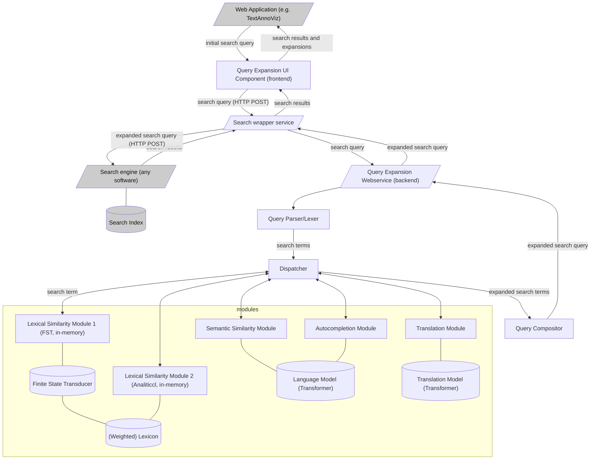

# Kweepeer: Interactive Query Expansion Service

[](https://www.repostatus.org/#wip)
[](https://crates.io/crates/kweepeer)
[](https://docs.rs/kweepeer/)
[](https://github.com/knaw-huc/kweepeer/releases/)

## Introduction

The Globalise project requests an interactive query expansion webservice which expands terms in search queries with available synonyms and other suggestions. These expansions are returned to the caller, for display in a user interface, and the caller has control over which suggestions to accept or discard, offering a high degree of control over the final query. Please see [the original plan](PLAN.md) for details and initial discussion.

This repository holds the backend service and underlying library that provides query expansion, it is called *Kweepeer* (pronounceas /ˈkʋe.pɪːr/ or  /ˈkwe.peːr/) and named after a fruit known as Quince in English.


## Installation

### From source

Production environments:

```
$ cargo install kweepeer
```

Development environments:

```
$ git clone git@github.com:knaw-huc/kweepeer.git
$ cd kweepeer
$ cargo install --path .
```

Development versions may require a development version of
[analiticcl](https://github.com/proycon/analiticcl) as well, clone it alongside kweepeer and add a
`kweepeer/.cargo/config.toml` with:

```toml
#[dependencies.analiticcl]
paths = ["../analiticcl"]
```

### Usage

To use the webservice, run `kweepeer` and point it to a kweepeer configuration file.
For the command-line interface, run `kweepeercli` and point it to a kweepeer configuration file.
To start using the Rust library, run `cargo add kweeper` within your Rust project.

### Configuration

(to do)

## Architecture

This schema presents an architecture with some proposed expansion modules. The modules
will be written in Rust, building on a common API, and compiled into the query expansion service.
Module details may need to be worked out further.



